# 💫 About Me

  

 
- 🔗 Blockchain and Backend Engineer with 6+ years of hands-on experience in design&building robust blockchain and backend solutions 
- 👌 Proficient in on-chain and off-chain development across various blockchain networks like Ethereum and Solana 
- 👍 Experienced in DevOps, CI/CD, and Cloud infrastructure, especially with AWS, DigitalOcean, GCP and Azure 
 

# 💻 My SkillSet
---

### Languages

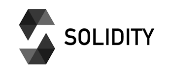
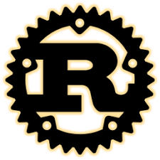

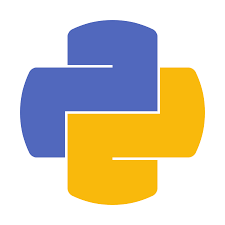

 
 

### Blockchains and DEX

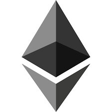

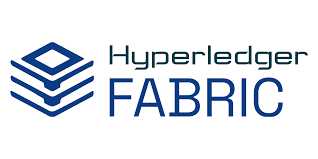
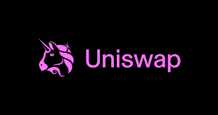
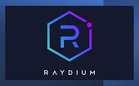
 
 

### Frameworks

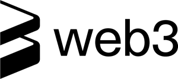

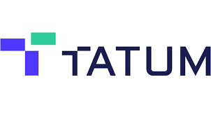
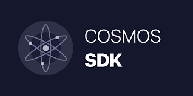 

 

### Database

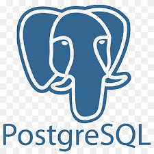

 

 

### DevOps and Cloud

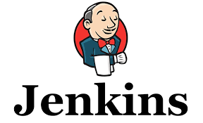

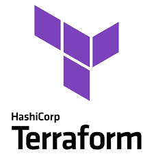

 

 

### Others

  

### 

### 

